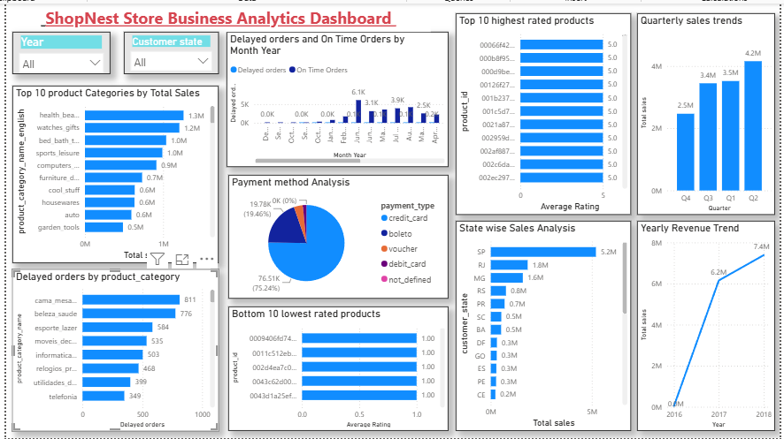

# ShopNest Store — Business Analytics Dashboard

## Project Overview

An interactive Power BI dashboard developed to analyze ShopNest Store's sales performance, product categories, customer behavior, payment methods, and revenue trends.

## Objectives

- Analyze overall sales and revenue performance
- Identify top-performing product categories
- Track delayed and on-time orders
- Analyze payment methods used by customers
- Compare sales performance across states
- Identify highly and poorly rated products
- Monitor quarterly and yearly sales trends

## Tools & Technologies

- Power BI
- DAX
- Power Query
- Excel

## Dashboard Preview

## Key Analysis

The dashboard provides insights into:

- Product category performance
- State-wise sales
- Payment method distribution
- Product ratings
- Order delays
- Quarterly sales trends
- Yearly revenue trends

## Project Files

- `dashboard-overview.png` — Dashboard preview
- Power BI dashboard file — Available separately due to GitHub file-size limitations
